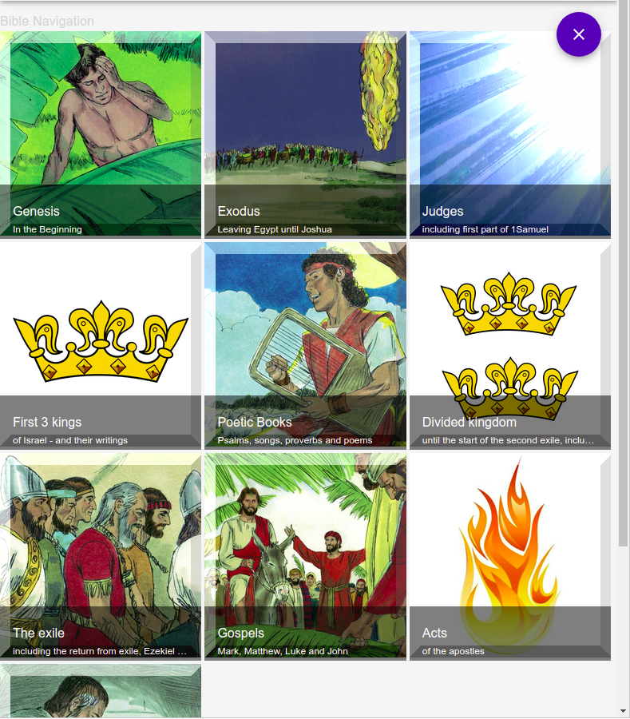
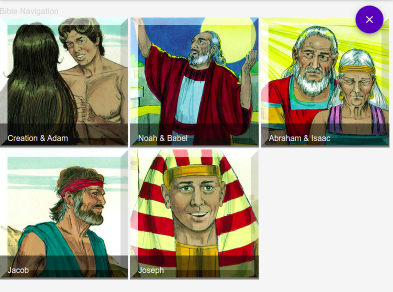

# bible-picture-navigation

## Requirements

For development, Node.js needs to be installed.

## Install

    git clone https://github.com/ORG/PROJECT.git
    cd PROJECT
    npm install

## Start - for development

    npm start

## Build - for production

    npm run build

## Deploy

Copy all the files in the "build" directory to the root folder on a static host

## Multi Level Navigation

Audio Bible multi level hierarchical navigation.

Here is how the demo of such a conceptual navigation looks like *(initial level: 10 top level pictures introducing the whole Bible, as stories to listen to)*:

&nbsp;

A click on the **"Genesis"** icon drills down to the level of stories about the persons *(Adam, Noah, the Patriarchs and Joseph)* who are part of the wider Genesis story:

&nbsp;

Drilling down further by selecting **"Joseph"** now opens the list of the various stories about him:

&nbsp;

The audio playback for the Audio Bible format still has some serious limitations:

- bookmarking not working
- no automatic continuing to the next audio
- navigation picture not displayed
- missing navigation hierarchical indicators

## Audio Bible special structure

Two Bible naming convention schemes are handled *(in code + structured data)*:

- **Free Audiobible** - *osisFreeAudiobible.js*
- **Faith Comes By Hearing (FCBH)** - *osisAudiobibleId.js* - For this to work there is a required "pathPattern" field, which has to be present in the series Json data. The syntax of this field is an array as follows:

  - Any string entry is used exactly as written
  - Integer 1 = a special FCBH Bible book numbering scheme
  - Integer 2 = a spelled out Bible book
  - Integer 3 = the chapter number

Example of the FCBH format:

  >"pathPattern": [1, "\_", 3, "\_", 2, "_ENGWEBN2DA.mp3"]

  For John chapter 3, then the above example is converted to:

  >B04_03_John_ENGWEBN2DA.mp3

Structured data for the Audio Bible navigation is kept in the following file in order to display titles for all chapters in the Bible:

- *osisChTitles.js*
